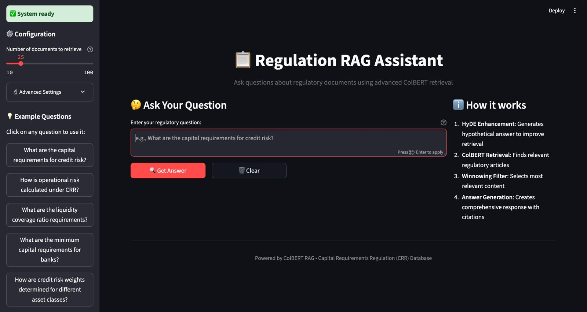

# ColBERT RAG Assistant for Regulatory Documents

[](https://www.python.org/downloads/)
[](https://opensource.org/licenses/MIT)

A sophisticated ColBERT-based Retrieval-Augmented Generation (RAG) system designed specifically for querying regulatory documents, particularly the **Capital Requirements Regulation (CRR)**.

## 🎯 Overview

This system provides an advanced ColBERT RAG implementation with a professional Streamlit web interface for querying complex regulatory documents. It uses state-of-the-art dense retrieval with ColBERT embeddings, HyDE query enhancement, and winnowing filters to deliver accurate, cited answers to regulatory questions.

## ✨ Key Features

- **🔍 Advanced ColBERT Retrieval**: Dense retrieval using lightonai/Reason-ModernColBERT embeddings
- **🧠 HyDE Enhancement**: Hypothetical Document Embeddings for improved query understanding
- **🎯 Winnowing Filter**: Intelligent content filtering for maximum relevance
- **🎨 Professional Web UI**: Beautiful Streamlit interface with real-time processing
- **📚 Source Citations**: Comprehensive regulatory article references
- **⚡ Real-time Processing**: Visual progress indicators through the RAG pipeline

## 🎨 Web Interface



*Professional web interface for querying regulatory documents with real-time ColBERT processing*

### UI Features

- **Interactive Question Input**: Large text area with 8 pre-loaded regulatory example questions
- **Real-time Processing**: Visual progress indicators showing HyDE → ColBERT → Winnowing → Answer Generation
- **Professional Styling**: Clean, modern design with proper text contrast and readability
- **Source Citations**: Expandable section showing regulatory article references
- **System Health Monitoring**: Real-time status of Weaviate connection and API keys
- **Configurable Settings**: Adjustable retrieval parameters (10-100 documents)

## 🚀 Quick Start

### Prerequisites

- Python 3.10 or higher
- OpenRouter API key (for LLM processing)
- Docker (for Weaviate vector database)

### Installation

1. **Clone the repository**:
   ```bash
   git clone <repository-url>
   cd regulation-kg-eval
   ```

2. **Install dependencies**:
   ```bash
   pip install -e .
   ```

3. **Set up environment variables**:
   ```bash
   cp example.local.env .env
   # Edit .env with your API keys
   ```

   Required environment variables:
   ```bash
   OPENROUTER_API_KEY="your-openrouter-api-key"
   DATA_PATH="data"  # Optional, defaults to "data"
   ```

4. **Start Weaviate database**:
   ```bash
   docker run --detach -p 8080:8080 -p 50051:50051 cr.weaviate.io/semitechnologies/weaviate:1.30.1
   ```

5. **Initialize ColBERT database** (first time only):
   ```bash
   python src/regulations_rag_eval/rag_implementations/ColBERT/colbert.py
   ```
   This creates the Weaviate vector database with ColBERT embeddings for the regulatory documents.

6. **Launch the web interface**:
   ```bash
   streamlit run streamlit_app_working.py --server.port 8503
   ```

7. **Open your browser** to `http://localhost:8503` and start asking regulatory questions!

## 🔧 How It Works

### ColBERT RAG Pipeline

1. **HyDE Enhancement**: Generates hypothetical answers to improve retrieval quality
2. **ColBERT Retrieval**: Uses dense embeddings to find relevant regulatory articles
3. **Winnowing Filter**: Applies intelligent filtering to select the most relevant content
4. **Answer Generation**: Creates comprehensive responses with proper citations

### Model Configuration

- **Embedding Model**: `lightonai/Reason-ModernColBERT`
- **HyDE Model**: `google/gemini-2.5-flash`
- **Answer Generation**: `openai/gpt-4.1`
- **Vector Database**: Weaviate

## 📋 Example Questions

The interface includes 8 pre-loaded regulatory questions:

- "What are the capital requirements for credit risk?"
- "How is operational risk calculated under CRR?"
- "What are the liquidity coverage ratio requirements?"
- "What are the minimum capital requirements for banks?"
- "How are credit risk weights determined for different asset classes?"
- "What is the definition of Tier 1 capital?"
- "What are the requirements for internal ratings-based approaches?"
- "How is the leverage ratio calculated?"

## 🏗️ Project Structure

```
regulation-kg-eval/
├── src/regulations_rag_eval/           # Core framework
│   ├── rag_implementations/ColBERT/    # ColBERT implementation
│   │   ├── generate_answers.py         # Main answer generation
│   │   ├── colbert.py                  # ColBERT core logic
│   │   ├── prompts/                    # YAML prompt templates
│   │   └── utils/                      # Utility functions
│   ├── eval_framework/                 # Evaluation tools
│   └── eval_framework_data_types.py    # Type definitions
├── data/                               # Regulatory documents and results
│   ├── CRR.txt                        # Capital Requirements Regulation
│   └── ColBERT/                       # ColBERT-specific data
├── streamlit_app_working.py            # Main Streamlit UI
├── images/UI.jpeg                      # UI screenshot
└── pyproject.toml                      # Dependencies
```

## 🛠️ Development

### Running the ColBERT System

The system can be used both through the web interface and programmatically:

```python
from regulations_rag_eval.rag_implementations.ColBERT.generate_answers import generate_answers

# Generate answers for regulatory questions
results = await generate_answers(
    questions=["What are the capital requirements for credit risk?"],
    implementation_name="ColBERT",
    params={"k": 25}
)

print(f"Answer: {results[0].answer}")
print(f"Citations: {results[0].retrieved_articles}")
```

### Configuration

The system uses YAML configuration files for prompts:

- `prompts/hyde.yaml` - HyDE enhancement prompts
- `prompts/winnowing.yaml` - Content filtering prompts  
- `prompts/answer_generation.yaml` - Final answer generation prompts

## 📊 Data Sources

- **Primary Document**: Capital Requirements Regulation (CRR)
- **Question Dataset**: Curated regulatory questions with expert annotations
- **Vector Database**: Weaviate with ColBERT embeddings
- **Article Chunking**: Intelligent segmentation of regulatory articles

## 🤝 Contributing

1. Fork the repository
2. Create a feature branch (`git checkout -b feature/amazing-feature`)
3. Commit your changes (`git commit -m 'Add amazing feature'`)
4. Push to the branch (`git push origin feature/amazing-feature`)
5. Open a Pull Request

## 📄 License

This project is licensed under the MIT License - see the [LICENSE](LICENSE) file for details.
